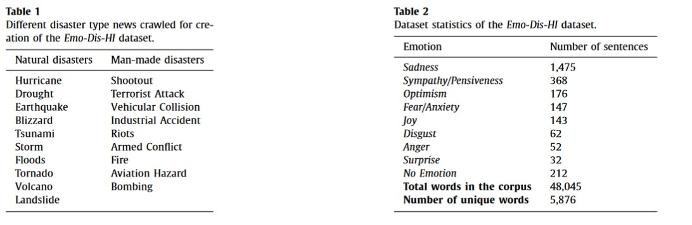
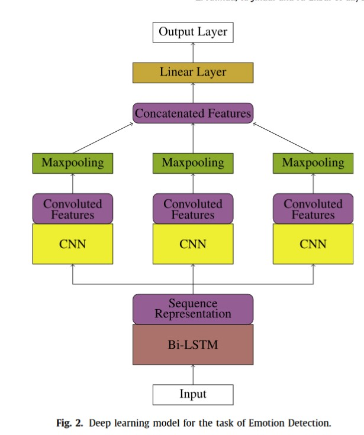

# Traansfer Learning for Emotion Detection using Cross Lingual Embedding

This repository contains all the code and experiments for our paper titled [Borrow from rich cousin: transfer learning for emotion detection using cross lingual embedding](https://reader.elsevier.com/reader/sd/pii/S0957417419305536?token=882DA4ECCC6FC33436ACCE33C4EC8F6013A1980600EB62A0800A439B9FD9A960DEF1017F93D15B83FCD2BD6CA309A351). The paper was published in [Expert Systems with Applications](https://www.journals.elsevier.com/expert-systems-with-applications) which has an impact factor of 4.292, based on the Journal Citation Reports 2018 by Clarivate Analytics (released June 2019). More about the rankings of various AI conferences/publications can be found on [Google Scholar](https://scholar.google.com/citations?view_op=top_venues&hl=en&vq=eng_artificialintelligence). 

*Note: It's a dump of all the code and the experiments that we did. Might be a bit difficult to go through. But you are welcome to contact me for any clarification.*

## Abstract

We propose an effective technique to mitigate the problem of resource scarceness for emotion detection in Hindi by leveraging information from a resourcerich language like English. Our method follows a deep learning framework, that shows when transferring knowledge between the two languages, transfer learning in shared space performs significantly better than when learnt in separate vector spaces. We use a combination of *Convolution Neural Network (CNN)* and *Bi-Directional Long Short-Term Memory (Bi-LSTM)*. As there is no available emotion labeled dataset for Hindi, we create a new dataset for emotion detection in disaster domain by annotating sentences of news documents with nine different classes, based on Plutchik’s wheel of emotions. Experiments show that our proposed method achieves an F1-score of **0.477** when trained on Hindi dataset using monolingual word embeddings as features. In comparison to this, we observe a significant performance boost with a F1-score of **0.53** when cross-lingual word embeddings are used as features.

## Dataset Creation

Due to lack of avalable dataset in Hindi language, we created our own dataset (referred to as *Emo-Dis-Hi*) by crawling popular
Hindi news websites and obtaining sentences releated to disaster events. We then perform sentence level emotion annotation based on Plutchik's wheel of emotions. A snapshot containig a brief description of the datset from the paper is as follows:

## Model

The model that we found worked the best after an ablation study:

## Transfer Learning

We used cross lingual transfer learning. First the words are respresented in a shared vector space since the source and the target language might be in different language. Then transfer learning is deployed. We also deply different methods of transfer learning. More details can be found in the paper

## Results

The results of our experiments indicate that transfer learning helps to improve the performance of the system and that the material of the dataset is more important than the language of the dataset. We achieved an improvement from 0.47 to 0.53 when transfer learning was used. 
